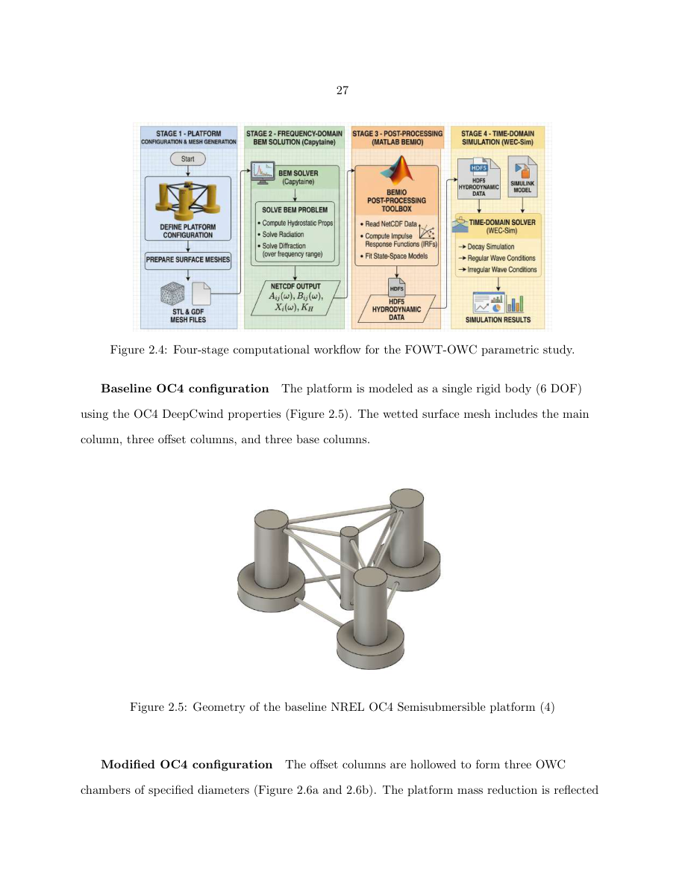
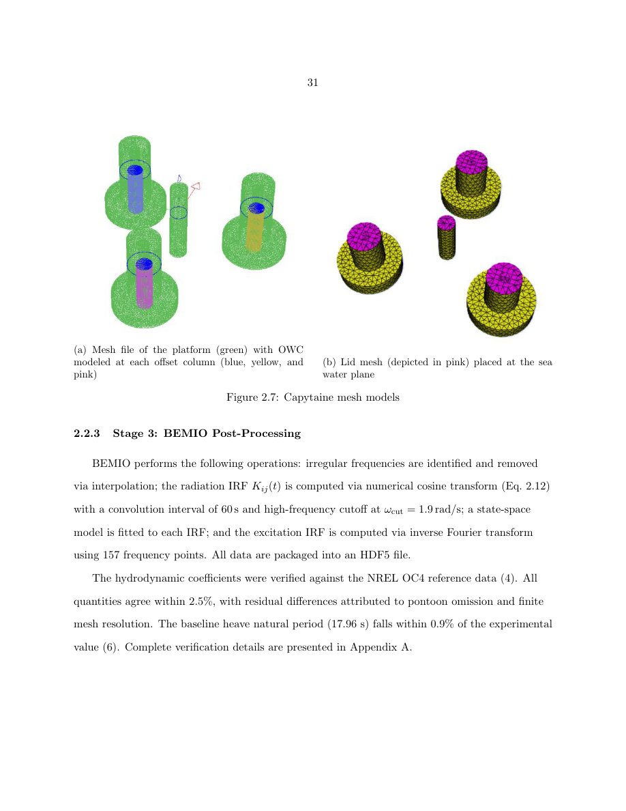
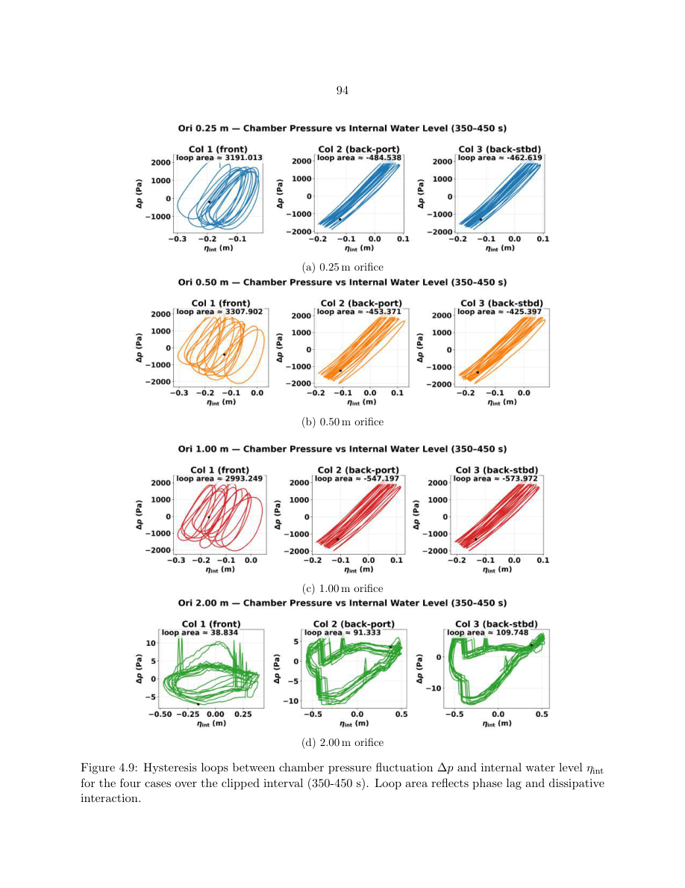

# OWC-FOWT Hydro BEM/WEC-Sim Workflow

A GitHub-ready, open-source reduced-order hydrodynamic workflow for an oscillating-water-column-integrated floating offshore wind turbine platform derived from the OC4 DeepCwind semisubmersible.

This repository is organized for reproducibility and extension. It separates the **solid baseline/no-OWC case** from the **4 m hollow OWC case**, because their geometry files, Capytaine body definitions, hydrodynamic files, WEC-Sim input files, and Simulink models are not interchangeable.



## What this repository does

The workflow converts platform geometry into time-domain WEC-Sim simulations through four stages:

1. **Geometry and body definition**: the platform mesh, body order, centers of gravity, water depth, and wave-frequency grid are defined in Python.
2. **Capytaine frequency-domain BEM**: Capytaine solves linear potential-flow radiation and diffraction problems and writes hydrodynamic coefficients to NetCDF.
3. **BEMIO post-processing**: BEMIO reads the Capytaine NetCDF file, removes/cleans problematic frequencies, computes radiation and excitation impulse-response functions, fits radiation state-space models, and writes the WEC-Sim HDF5 hydrodynamic file.
4. **WEC-Sim time-domain simulation**: WEC-Sim uses the HDF5 file, the Simulink model, and `wecSimInputFile.m` to simulate free decay, regular waves, or irregular waves.

The repository contains two ready-to-use cases:

| Case folder | Purpose | Hydrodynamic body model | WEC-Sim model |
|---|---|---|---|
| `cases/oc4_baseline_no_owc` | Solid baseline/reference case | One platform body | `oc4_baseline_no_owc_wecsim.slx` |
| `cases/oc4_hollow_owc_4m` | 4 m hollow OWC case | Platform shell + 3 OWC piston bodies | `oc4_hollow_owc_4m_wecsim.slx` |

## Why this matters

The engineering question is not simply whether material can be removed from the offset columns. Hollowing changes mass, waterplane area, hydrostatic restoring, added mass, radiation damping, and rigid-body response. When the hollow columns are treated as OWC chambers, the internal water surfaces and trapped air volumes also introduce hydro-pneumatic dynamics. This repository is structured to make that coupled design problem transparent:

- the baseline case gives the reference response;
- the hollow case exposes how geometry and OWC piston bodies change the reduced-order hydrodynamics;
- the WEC-Sim layer lets users compare free-decay, regular-wave, and irregular-wave response histories;
- the passive OWC/PTO proxy lets users sweep chamber restriction by changing one parameter, `orificeDiameter`.

## Repository tree

```text
owc-fowt-hydro-bem-wecsim/
├── README.md
├── LICENSE
├── CITATION.cff
├── requirements.txt
├── environment.yml
├── pyproject.toml
├── .gitignore
├── src/
│   └── owc_fowt_hydro/
│       ├── __init__.py
│       └── capytaine_runner.py
├── cases/
│   ├── oc4_baseline_no_owc/
│   │   ├── README.md
│   │   ├── capytaine/
│   │   │   └── run_capytaine_oc4_baseline_no_owc.py
│   │   ├── bemio/
│   │   │   └── bemio_oc4_baseline_no_owc.m
│   │   ├── geometry/
│   │   │   ├── oc4_semisubmersible_baseline_bem.stl
│   │   │   └── oc4_semisubmersible_baseline_cg.stl
│   │   ├── hydroData/
│   │   │   ├── oc4_baseline_capytaine.nc
│   │   │   └── oc4_baseline_wecsim.h5
│   │   ├── oc4_baseline_no_owc_wecsim.slx
│   │   ├── wecSimInputFile.m
│   │   └── userDefinedFunctions.m
│   └── oc4_hollow_owc_4m/
│       ├── README.md
│       ├── capytaine/
│       │   └── run_capytaine_oc4_hollow_owc_4m.py
│       ├── bemio/
│       │   └── bemio_oc4_hollow_owc_4m.m
│       ├── geometry/
│       │   ├── oc4_hollow_owc_4m_bem.stl
│       │   ├── oc4_hollow_owc_4m_cg.stl
│       │   └── owc_piston_4m.stl
│       ├── hydroData/
│       │   ├── oc4_hollow_owc_4m_capytaine.nc
│       │   └── oc4_hollow_owc_4m_wecsim.h5
│       ├── oc4_hollow_owc_4m_wecsim.slx
│       ├── wecSimInputFile.m
│       └── userDefinedFunctions.m
├── docs/
│   ├── CASE_TREE.md
│   ├── FILE_AUDIT.md
│   ├── METHOD_THEORY.md
│   ├── PARAMETERS.md
│   ├── ADD_BASE_GEOMETRY_CHECKLIST.md
│   ├── OFFICIAL_DOC_REFERENCES.md
│   └── media/
│       ├── README.md
│       ├── thesis_placeholders/
│       └── videos/
└── scripts/
    └── check_repository.py
```

## Installation

### Python / Capytaine environment

Use Conda:

```bash
conda env create -f environment.yml
conda activate owc-fowt-hydro
```

or a Python virtual environment:

```bash
python -m venv .venv
source .venv/bin/activate
pip install -r requirements.txt
```

### MATLAB / WEC-Sim environment

Install WEC-Sim and add it to the MATLAB path. Run each case from its case directory, not from the repository root:

```matlab
cd cases/oc4_baseline_no_owc
wecSim
```

or

```matlab
cd cases/oc4_hollow_owc_4m
wecSim
```

WEC-Sim expects each case directory to contain the geometry folder, the hydrodynamic `.h5` file, `wecSimInputFile.m`, and the Simulink model.

## Quick start

Run the repository static check:

```bash
python scripts/check_repository.py
```

Run the baseline WEC-Sim case in MATLAB:

```matlab
cd cases/oc4_baseline_no_owc
wecSim
```

Run the 4 m hollow OWC WEC-Sim case in MATLAB:

```matlab
cd cases/oc4_hollow_owc_4m
wecSim
```

The included `userDefinedFunctions.m` files save optional figures to:

```text
cases/<case_name>/results/figures/
```

No user-specific Windows or cluster paths are required.

## Full workflow: from geometry to WEC-Sim

### Step 1 — Capytaine BEM solve

Baseline:

```bash
python cases/oc4_baseline_no_owc/capytaine/run_capytaine_oc4_baseline_no_owc.py --overwrite
```

Hollow OWC:

```bash
python cases/oc4_hollow_owc_4m/capytaine/run_capytaine_oc4_hollow_owc_4m.py --overwrite
```

The Capytaine scripts define the frequency grid, water depth, density, wave heading, body order, and mesh files. The baseline script uses one body. The hollow script uses one platform shell plus three OWC piston bodies and generates the GDF piston meshes automatically.

### Step 2 — BEMIO conversion

Baseline:

```matlab
cd cases/oc4_baseline_no_owc/bemio
bemio_oc4_baseline_no_owc
```

Hollow OWC:

```matlab
cd cases/oc4_hollow_owc_4m/bemio
bemio_oc4_hollow_owc_4m
```

The BEMIO scripts use the same settings in both cases:

| Quantity | Value |
|---|---:|
| Radiation IRF duration | 60 s |
| High-frequency cutoff | 1.9 rad/s |
| Excitation IRF points | 157 |
| State-space radiation fit | enabled |

### Step 3 — WEC-Sim time-domain simulation

Each case has a dedicated `wecSimInputFile.m`. This is where the user selects no-wave decay, regular waves, or PM irregular waves. The most important WEC-Sim objects are:

- `simulationClass`: simulation time, solver, ramp time, and Simulink model file;
- `waveClass`: no-wave, regular, or irregular wave definition;
- `bodyClass`: hydrodynamic body data and visualization geometry;
- `constraintClass`: global reference constraint/joint;
- `mooringClass`: linearized vertical restoring proxy;
- `ptoClass`: only in the hollow OWC case, used as a passive OWC restriction proxy.

## How the calculations connect physically

### Capytaine outputs

Capytaine computes frequency-dependent hydrodynamic coefficients for the body or body system:

- added mass, `A(ω)`;
- radiation damping, `B(ω)`;
- excitation force, `X(ω)`;
- hydrostatic restoring information.

For the baseline case, the hydrodynamic system is one platform body. For the hollow OWC case, the hydrodynamic system is a coupled multi-body problem: the platform shell plus three OWC piston bodies. This distinction is why the two cases need separate geometry, Capytaine drivers, hydrodynamic files, Simulink models, and WEC-Sim inputs.



### BEMIO outputs

BEMIO converts the frequency-domain hydrodynamic data into the time-domain form needed by WEC-Sim. In practical terms, BEMIO is the bridge between the Capytaine `.nc` output and the WEC-Sim `.h5` hydrodynamic input. It computes radiation impulse-response functions, excitation impulse-response functions, and state-space radiation models.

### WEC-Sim time-domain simulation

WEC-Sim integrates the platform motion in time using the hydrodynamic data and the Simulink model. Free-decay simulations reveal natural periods and damping behavior. Regular waves test a single forcing period. Irregular PM waves distribute energy over multiple frequencies and are more useful for design-condition ranking.


### OWC passive restriction proxy

In the hollow OWC case, the three internal water columns are represented as piston bodies. The PTO elements placed at the chamber centroids approximate the restoring/damping effect of the OWC water column and the passive orifice restriction. Change this line in `cases/oc4_hollow_owc_4m/wecSimInputFile.m` to sweep passive restriction:

```matlab
orificeDiameter = 2.0;      % change to 0.25, 0.50, 1.00, or 2.00
```

The repository includes a placeholder figure from the thesis for interpreting pressure/water-level hysteresis loops:



## Important case-specific warnings

1. Do not use the baseline Simulink model with the hollow OWC `wecSimInputFile.m`.
2. Do not use the hollow OWC `.h5` file in the baseline case.
3. Keep WEC-Sim body order synchronized with the Capytaine body order.
4. If you regenerate Capytaine data, rerun BEMIO before WEC-Sim.
5. If you add the exact missing baseline CG/lid geometry, follow `docs/ADD_BASE_GEOMETRY_CHECKLIST.md`.

## What was renamed from the uploaded files

| Uploaded / earlier name | GitHub-ready name |
|---|---|
| `fowt_med_MS_v2_withoutpto.py` | `cases/oc4_baseline_no_owc/capytaine/run_capytaine_oc4_baseline_no_owc.py` |
| `02_12_owc_withoutpto_base.nc` | `cases/oc4_baseline_no_owc/hydroData/oc4_baseline_capytaine.nc` |
| `02_12_owc_withoutpto_base_clean.h5` | `cases/oc4_baseline_no_owc/hydroData/oc4_baseline_wecsim.h5` |
| `fowt_med_02_19.slx` | `cases/oc4_baseline_no_owc/oc4_baseline_no_owc_wecsim.slx` |
| baseline `wecSimInputFile.m` | `cases/oc4_baseline_no_owc/wecSimInputFile.m` |
| `fowt_med_MS_v2.py` | `cases/oc4_hollow_owc_4m/capytaine/run_capytaine_oc4_hollow_owc_4m.py` |
| `02_19_owc_withcolumn_4m.nc` | `cases/oc4_hollow_owc_4m/hydroData/oc4_hollow_owc_4m_capytaine.nc` |
| `02_19_owc_withcolumn_4m_clean.h5` | `cases/oc4_hollow_owc_4m/hydroData/oc4_hollow_owc_4m_wecsim.h5` |
| `wafowt_nomoor_withowc.slx` | `cases/oc4_hollow_owc_4m/oc4_hollow_owc_4m_wecsim.slx` |
| `capy_call2.py` | `src/owc_fowt_hydro/capytaine_runner.py` |

## Media placeholders

The figures in `docs/media/thesis_placeholders/` are exported page-level placeholders from the thesis draft. Replace them with clean cropped figures before final GitHub release if desired. The `docs/media/videos/` folder contains a placeholder note for future WEC-Sim visualization or result-animation videos.

## Official documentation references

Only official tool documentation is cited in this repository:

- Capytaine documentation: https://capytaine.org/stable/user_manual/quickstart.html
- Capytaine NetCDF/export documentation: https://capytaine.org/stable/user_manual/export_output.html
- WEC-Sim workflow documentation: https://wec-sim.github.io/WEC-Sim/dev/user/workflow.html
- WEC-Sim code-structure documentation: https://wec-sim.github.io/WEC-Sim/dev/user/code_structure.html
- WEC-Sim advanced features and BEMIO documentation: https://wec-sim.github.io/WEC-Sim/dev/user/advanced_features.html

## License

See `LICENSE`. Verify that all geometry, hydrodynamic data, and Simulink models can be redistributed under the selected license before making the repository public.
