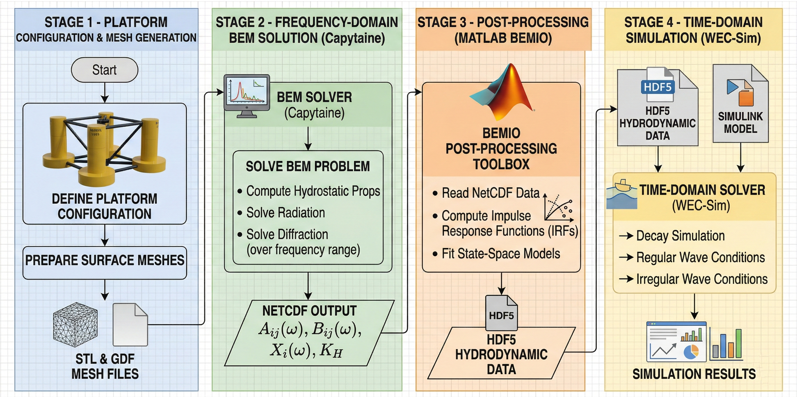
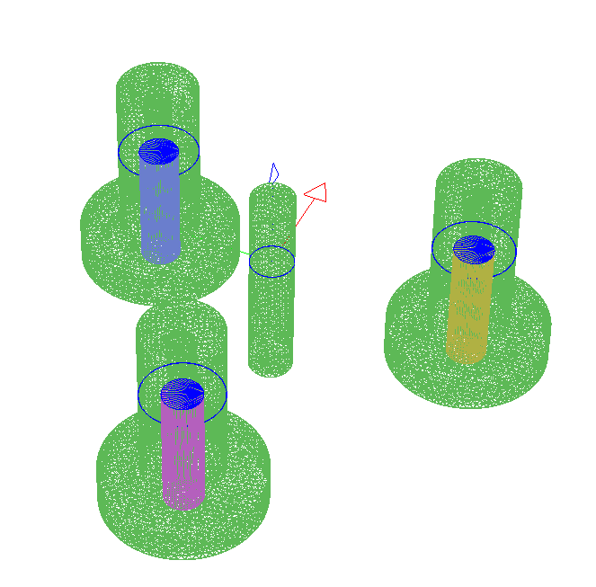
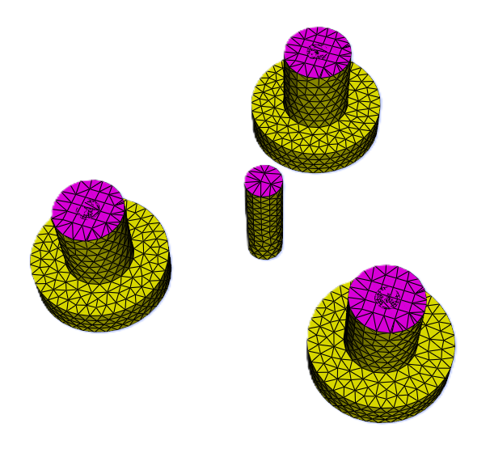
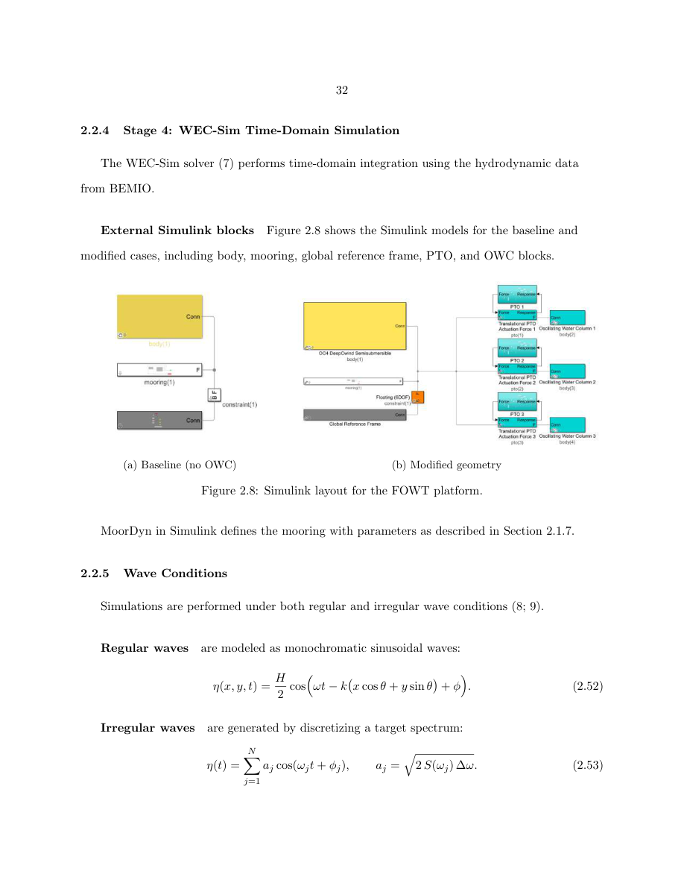

# WAFOWT-CAPY-WECSIM

An open-source, end-to-end, reproducible workflow for the reduced-order
hydrodynamic modelling of an oscillating-water-column (OWC) integrated
floating offshore wind turbine (FOWT) platform built on the NREL OC4
DeepCwind semisubmersible. The same workflow applies, with replaced
geometry and mass values, to any semisubmersible platform.

The pipeline has four stages, each living in its own top-level folder:

| Stage | Tool                                                                       | Folder        | Role                                                                                          |
| :---: | :------------------------------------------------------------------------- | :------------ | :-------------------------------------------------------------------------------------------- |
|   1   | Python + STL                                                               | `geometry/`   | Platform geometry and surface mesh                                                            |
|   2   | [Capytaine](https://capytaine.org/) [1]                                    | `capytaine/`  | Linear potential-flow BEM solve; frequency-domain coefficients written to NetCDF              |
|   3   | [BEMIO](https://wec-sim.github.io/WEC-Sim/dev/user/advanced_features.html#bemio) (MATLAB) [2] | `hydroData/`  | Radiation/excitation impulse response functions, state-space realisation; WEC-Sim HDF5 file   |
|   4   | [WEC-Sim](https://wec-sim.github.io/WEC-Sim/) [3]                          | `wecsim/`     | Time-domain coupled simulation (free decay, regular waves, irregular waves)                    |


*Four-stage computational workflow: geometry -> Capytaine BEM -> BEMIO ->
WEC-Sim time-domain.*

Two cases are provided, sharing one input file, one post-processor, and
one set of Python helpers:

| Case   | Description                                | Bodies | DOF | Hydro data    | Simulink model        |
| :----- | :----------------------------------------- | :----: | :-: | :------------ | :-------------------- |
| base   | Solid OC4 baseline (no OWC)                |   1    |  6  | `base.h5`     | `wafowt_base.slx`     |
| hollow | OC4 with three offset-column OWC chambers  |   4    |  9  | `hollow.h5`   | `wafowt_hollow.slx`   |

---

## Table of contents

1. [Repository structure](#1-repository-structure)
2. [Installation](#2-installation)
3. [Quick start](#3-quick-start)
4. [Workflow methodology](#4-workflow-methodology)
5. [Theory summary](#5-theory-summary)
6. [Running the cases](#6-running-the-cases)
7. [Verification](#7-verification)
8. [Adapting the workflow to a different platform](#8-adapting-the-workflow-to-a-different-platform)
9. [Troubleshooting](#9-troubleshooting)
10. [References](#10-references)
11. [Citing this workflow](#11-citing-this-workflow)
12. [License](#12-license)

---

## 1. Repository structure

```
wafowt-capy-wecsim/
|-- README.md
|-- LICENSE
|-- environment.yml                  conda environment (recommended)
|-- requirements.txt                 pip alternative
|-- .gitignore
|
|-- capytaine/                       STAGE 2: Python BEM drivers
|   |-- capytaine_call.py            shared helpers (mesh, body, solver, export)
|   |-- wafowt_capy_base.py          baseline driver (1 body, 6 DOF)
|   `-- wafowt_capy_hollow.py        hollow driver  (4 bodies, 9 DOF)
|
|-- geometry/                        STAGE 1: surface meshes
|   |-- base.stl                     baseline OC4 wetted surface (CG-aligned)
|   |-- hollow.stl                   hollow shell                (CG-aligned)
|   `-- owc_piston_4m.stl            OWC piston visualisation mesh
|
|-- hydroData/                       STAGE 2 outputs + STAGE 3 scripts/outputs
|   |-- base/
|   |   |-- bemio_base.m             BEMIO post-processor
|   |   |-- base.nc                  Capytaine output    (created by stage 2)
|   |   `-- base.h5                  WEC-Sim hydro data  (created by stage 3)
|   `-- hollow/
|       |-- bemio_hollow.m
|       |-- hollow.nc
|       `-- hollow.h5
|
|-- wecsim/                          STAGE 4: time-domain simulation
|   |-- wecSimInputFile.m            generic input file, switches on caseType
|   |-- userDefinedFunctions.m       generic post-processor
|   |-- wafowt_base.slx              baseline Simulink model
|   `-- wafowt_hollow.slx            hollow OWC Simulink model
|
`-- docs/
    `-- media/
        |-- thesis_placeholders/     figures used in this README
        `-- videos/                  simulation animations (optional)
```

The pipeline order is recoverable from the folder names. Each folder
is one stage.

---

## 2. Installation

### 2.1 Prerequisites

Two independent toolchains are required.

| Toolchain | Required version                            | Required components                                              |
| :-------- | :------------------------------------------ | :--------------------------------------------------------------- |
| Python    | 3.10 - 3.12 (Capytaine supports 3.8+)        | numpy, scipy, xarray, netCDF4, matplotlib, meshio, Capytaine     |
| MATLAB    | R2020b or later (four latest releases tested by WEC-Sim) [4] | Simulink, Simscape, Simscape Multibody          |

Both run on Windows, macOS, and Linux. A working `git` client is
recommended; `git-lfs` is needed if you intend to clone WEC-Sim's
bundled large `.h5` example files [4].

### 2.2 Python and Capytaine

Capytaine [1] is the linear potential-flow BEM solver used in stage 2.
Two installation routes are supported. The conda-forge route is
recommended because it ships precompiled wheels on all major platforms
and resolves the Fortran/MKL dependencies automatically [5].

**Conda (recommended).**

```bash
git clone https://github.com/rithikrn/wafowt-capy-wecsim.git
cd wafowt-capy-wecsim
conda env create -f environment.yml
conda activate wafowt-capy-wecsim
```

**Pip (alternative).**

```bash
git clone https://github.com/rithikrn/wafowt-capy-wecsim.git
cd wafowt-capy-wecsim
python -m venv .venv
source .venv/bin/activate            # Windows: .venv\Scripts\activate
pip install -r requirements.txt
```

**Verify:**

```bash
python -c "import capytaine as cpt; print('Capytaine', cpt.__version__)"
```

Expect Capytaine 2.2 or later. Full installation guide:
https://capytaine.org/stable/user_manual/installation.html [5].

### 2.3 MATLAB and WEC-Sim

WEC-Sim [3] is the time-domain solver used in stage 4. Follow the
official getting-started guide [4]:

**Step 1.** In MATLAB, type `ver` and confirm that all four toolboxes
listed in section 2.1 are present.

**Step 2.** Clone WEC-Sim (install Git LFS first so the example `.h5`
files come down correctly) [4]:

```bash
git lfs install
git clone https://github.com/WEC-Sim/WEC-Sim
```

Call this location `$WECSIM`.

**Step 3.** Add WEC-Sim to the MATLAB path. The one-time-per-session
form is:

```matlab
>> cd $WECSIM
>> addWecSimSource
```

For a permanent install, copy `$WECSIM/source/addWecSimSource.m` into a
`startup.m` file in your MATLAB start-up folder. Both options are
documented in [4].

**Step 4.** Refresh the Simulink library browser:

```matlab
>> slLibraryBrowser
```

The WEC-Sim block library should appear. Library blocks are saved in
R2020b format so newer MATLAB versions load them without complaint [4].

**Step 5.** Smoke-test the install with the WEC-Sim RM3 reference case:

```matlab
>> cd $WECSIM/examples/RM3
>> wecSim
```

A Mechanics Explorer window should open and figures should be produced.

### 2.4 BEMIO

BEMIO ships **with** WEC-Sim as MATLAB code [2]; there is no separate
install step. Once `$WECSIM/source` is on the MATLAB path (step 3
above), functions like `readCAPYTAINE`, `radiationIRF`,
`radiationIRFSS`, `excitationIRF`, `writeBEMIOH5`, and `plotBEMIO` are
available globally. The legacy Python BEMIO is no longer supported [2].

---

## 3. Quick start

After completing section 2, the full pipeline for either case is four
commands.

**Baseline case.**

```bash
python capytaine/wafowt_capy_base.py            # stage 2 -> base.nc
```
```matlab
>> cd hydroData/base ; bemio_base               % stage 3 -> base.h5
>> cd ../../wecsim                              % stage 4
>> %  edit wecSimInputFile.m -> caseType = 'base'
>> wecSim
```

**Hollow OWC case.**

```bash
python capytaine/wafowt_capy_hollow.py          # stage 2 -> hollow.nc
```
```matlab
>> cd hydroData/hollow ; bemio_hollow           % stage 3 -> hollow.h5
>> cd ../../wecsim                              % stage 4
>> %  edit wecSimInputFile.m -> caseType = 'hollow'
>> wecSim
```

The post-processor writes all figures to:

```
wecsim/results/figures/<caseType>/<seaState>/
```

---

## 4. Workflow methodology

### 4.1 Stage 1 -- Geometry and mass properties

The host platform is the NREL OC4 DeepCwind semisubmersible [6]
supporting the NREL 5 MW reference wind turbine [7]. Both cases share
the OC4 reference. The hollow variant replaces each of the three
offset columns with a vertical chamber open to the sea at the bottom and
capped by a trapped air volume at the top.

Wetted-surface meshes are triangulated STL co-located at the body's
centre of gravity, as required by the WEC-Sim body class [8]. Mass and
inertia values are hard-coded near the top of
`wecsim/wecSimInputFile.m` and **must be replaced** when adapting the
workflow to a different platform (section 8).

### 4.2 Stage 2 -- Capytaine BEM solve

Capytaine [1] solves the linear potential-flow radiation/diffraction
problem over a frequency grid. Default settings (in
`capytaine/capytaine_call.py`):

| Parameter                  | Value                             |
| :------------------------- | :-------------------------------- |
| Water density rho          | 1025 kg/m^3                       |
| Water depth h              | 200 m (OC4)                       |
| Angular frequency omega    | 150 uniform points in [0.02, 3.0] rad/s |
| Wave heading beta          | 0 rad (head seas)                 |
| Lid mesh                   | Auto-generated at SWL             |

The lid method [1] places a flat horizontal mesh inside the floating
body at the still water line to suppress the irregular frequencies that
otherwise pollute the BEM solution. Capytaine's
`Mesh.generate_lid(faces_max_radius=...)` API is used; the default panel
radius is 1.0 m.

The two case drivers compose the same helpers in `capytaine_call.py`:

- `wafowt_capy_base.py` builds one rigid `FloatingBody` with six DOFs
  (surge, sway, heave, roll, pitch, yaw), solves, and exports
  `hydroData/base/base.nc` via Capytaine's `export_dataset` [9].

- `wafowt_capy_hollow.py` builds the platform shell as a six-DOF rigid
  body and three single-DOF heaving piston disks at the chamber
  centroids. The four bodies are summed before being passed to
  `BEMSolver.fill_dataset`, signalling Capytaine to solve the coupled
  9 x 9 radiation/diffraction problem. The body-to-body coupling
  matrices are written to `hydroData/hollow/hollow.nc`.

Both drivers expose command-line overrides; use `--help` for the list.



*Capytaine mesh: (left) Platform mesh of the platform with OWC
chambers modelled at each offset column; (right) lid mesh placed at the
still water plane for the weeted platform.*

### 4.3 Stage 3 -- BEMIO post-processing

BEMIO [2] reads the Capytaine NetCDF file and produces the time-domain
quantities WEC-Sim needs. The processing steps used here:

| Step | Function                                       | Effect                                                                                |
| :--: | :--------------------------------------------- | :------------------------------------------------------------------------------------ |
|  1   | `readCAPYTAINE(hydro, ncFile, hsDir)`          | Reads radiation/diffraction coefficients and hydrostatic data                          |
|  2   | `radiationIRF(hydro, 60, [], [], [], 1.9)`     | Radiation IRF via cosine transform; 60 s convolution window, 1.9 rad/s cutoff [2, 10] |
|  3   | `radiationIRFSS(hydro, [], [])`                | State-space realisation of the radiation IRF (default order 10, R^2 >= 0.95)           |
|  4   | `excitationIRF(hydro, 60, [], [], [], 1.9)`    | Excitation IRF via inverse Fourier transform                                          |
|  5   | `writeBEMIOH5(hydro)`                          | Packages the result into a single WEC-Sim-ready HDF5 file                              |

The two scripts (`bemio_base.m`, `bemio_hollow.m`) differ only in the
input and output filenames.

### 4.4 Stage 4 -- WEC-Sim time-domain simulation

WEC-Sim [3] integrates the Cummins time-domain equation [11] using the
BEMIO HDF5 data. The Simulink models follow the standard WEC-Sim block
structure: global reference frame, one rigid body block per
hydrodynamic body, a constraint block, a mooring block, and (for the
hollow case) three translational PTO blocks acting on the OWC piston
bodies.

`wecsim/wecSimInputFile.m` drives both cases through one flag:

```matlab
caseType = 'hollow';     % 'base' or 'hollow'
```

When `caseType = 'base'`, the input file loads `wafowt_base.slx`,
declares one body backed by `../hydroData/base/base.h5`, sets the
baseline mooring stiffness, and skips PTO setup entirely.

When `caseType = 'hollow'`, the input file loads `wafowt_hollow.slx`,
declares one platform body and three OWC piston bodies backed by
`../hydroData/hollow/hollow.h5`, sets `simu.b2b = 1` for the multi-body
coupling, sets the hollow mooring stiffness, and defines three
translational PTOs at the chamber centroids. Each PTO has a
water-column hydrostatic stiffness `K_wc = rho_w * g * A_bore` and a
fixed linearised pneumatic-damping coefficient as a reduced-order proxy
for the OWC mechanism.

The default wave block is a regular wave at SS4 (H = 5.49 m,
T = 11.3 s). Free-decay and irregular Pierson-Moskowitz blocks are
present but commented; switch by uncommenting the desired block.

`userDefinedFunctions.m` runs automatically at the end of each `wecSim`
call and saves:

- wave elevation and (if applicable) spectrum plots;
- body-1 force and response plots in all six DOFs;
- PTO power plots per chamber (hollow case);
- optional 3D Simscape Mechanics Explorer animation (toggle via
  `saveAnimation`).


*WEC-Sim Simulink layouts: (left) baseline (no-OWC); (right) hollow OWC
case with platform shell plus three OWC piston bodies.*

Example simulation animations are in `docs/media/videos/`.

---

## 5. Theory summary

### 5.1 Linear potential-flow BEM

Under the standard linear potential-flow assumptions [12], the fluid
velocity is described by a scalar potential `Phi` satisfying Laplace's
equation in the fluid domain, the linearised free-surface boundary
condition on `z = 0`, and the body boundary condition on the wetted
surface. Capytaine solves this boundary-value problem with a collocation
BEM and returns, per frequency `omega`:

- the added-mass matrix `A(omega)`;
- the radiation damping matrix `B(omega)`;
- the excitation force vector `X(omega, beta)`;
- the hydrostatic stiffness matrix `K_H`.

The baseline case has 6 x 6 matrices; the hollow case has 9 x 9 matrices
(one extra heave DOF per OWC piston body).

### 5.2 Time-domain Cummins equation

WEC-Sim integrates, per body, the Cummins equation [11]:

```
( M + A_inf ) eta_ddot(t)
 + integral_0^t K_r(t - tau) eta_dot(tau) d tau
 + K_H eta(t)
 = F_exc(t) + F_visc(t) + F_moor(t) + F_PTO(t)
```

where `A_inf` is the infinite-frequency added mass and `K_r(t)` is the
radiation impulse-response function

```
K_r(t) = (2/pi) integral_0^infinity B(omega) cos(omega t) d omega.
```

BEMIO produces a state-space realisation `(A_r, B_r, C_r, D_r)` so the
convolution is evaluated as an ODE [10, 13], reducing run time.

### 5.3 OWC chamber model (reduced-order)

In the hollow case, each piston body's heave is the internal water
surface of one chamber. The trapped air above the piston gives a
pneumatic restoring force and the chamber outlet gives a pneumatic
damping force. The reduced-order PTO model used here is

```
F_PTO,k(t) = K_wc z_k(t) + c_pto z_dot_k(t)
```

with `K_wc = rho_w g A_bore` and `c_pto` a fixed linearised
pneumatic-damping coefficient. This is the simplest model that
preserves the qualitative behaviour at the reduced-order fidelity
targeted by this workflow.

### 5.4 Wave conditions

Wave conditions follow WEC-Sim conventions [3]. Regular waves are
monochromatic sinusoids `eta(x,t) = (H/2) cos(omega t - k x)`.
Irregular waves are constructed by superposition of the
Pierson-Moskowitz spectrum [14],

```
S_PM(omega) = (5/16) H_s^2 omega_p^4 omega^(-5)
              exp[ -(5/4) (omega_p / omega)^4 ].
```

### 5.5 Sea-state matrix

The standard sea-state matrix [6] used throughout:

| Sea state | H_s [m] | T_p [s] | Description |
| :-------: | :-----: | :-----: | :---------- |
| SS2       | 0.67    | 4.8     | mild        |
| SS3       | 2.44    | 8.1     | moderate    |
| SS4       | 5.49    | 11.3    | significant |
| SS5       | 10.0    | 13.6    | severe      |
| SS6       | 10.5    | 14.3    | very severe |

---

## 6. Running the cases

### 6.1 Free-decay tests

```matlab
% in wecSimInputFile.m:
waves = waveClass('noWaveCIC');
body(1).initial.displacement = [0, 0, 1.0];   % 1 m heave kick
```

Run `wecSim`. The damped oscillation gives the natural period directly.

### 6.2 Regular waves

The default block. Set the sea-state values:

```matlab
waves = waveClass('regular');
waves.height = 5.49;
waves.period = 11.3;
```

### 6.3 Irregular waves (Pierson-Moskowitz)

```matlab
waves = waveClass('irregular');
waves.height       = 2.44;
waves.period       = 8.1;
waves.spectrumType = 'PM';
waves.direction    = 0;
waves.phaseSeed    = 1;
```

`waves.phaseSeed` makes the irregular realisation deterministic and is
recommended for any quantitative comparison [3].

---

## 7. Verification

Heave natural period of the baseline case compared with published OC4
results:

| Source                                          | T_n,z [s]      | Method                            |
| :---------------------------------------------- | :------------- | :-------------------------------- |
| Robertson et al. 2014 [6]                       | 17.5           | WAMIT, moored                     |
| Koo et al. 2014 [15] (1:50 wave-basin)          | 17.8           | experiment                        |
| OC5 phase II multi-code range [16]              | 17.0 - 17.8    | multi-code                        |
| **This workflow** (Capytaine + BEMIO + WEC-Sim) | **17.96**      | linearised mooring, base case     |

A 2.6 % agreement with the NREL reference and 0.9 % with the
experimental value is typical for linear potential-flow models with a
simplified mooring proxy. Capytaine added mass, radiation damping, and
excitation magnitudes agree with the NREL OC4 reference data [6] to
within 2.5 %; residual differences are attributable to pontoon omission
and finite mesh resolution.

---

## 8. Adapting the workflow to a different platform

The workflow is platform-agnostic. To use it on a different
semisubmersible:

1. **Replace the meshes** in `geometry/` (`base.stl`, `hollow.stl`,
   and the OWC piston mesh if applicable). Meshes must be triangulated
   STL co-located at the body's centre of gravity.
2. **Update the centre of mass** in `capytaine/wafowt_capy_base.py`
   and `wafowt_capy_hollow.py` (`CENTER_OF_MASS`).
3. **Update the chamber geometry** in `capytaine/wafowt_capy_hollow.py`
   (`CHAMBER_DIAMETER`, `RADIAL_OFFSET`, `CHAMBER_POSITIONS`) if your
   platform has a different number or arrangement of chambers.
4. **Update mass, inertia, mooring stiffness, mooring pre-tension, and
   PTO locations** in `wecsim/wecSimInputFile.m` (all lines marked
   with `REPLACE` comments).
5. **Rebuild the Simulink models** `wafowt_base.slx` and
   `wafowt_hollow.slx` from the WEC-Sim library if your body count or
   PTO count differs.
6. **Re-run the pipeline**: `wafowt_capy_*.py`, then `bemio_*.m`, then
   `wecSim`.

---

## 9. Troubleshooting

1. **Base vs hollow are not interchangeable.** The base case has 6
   DOFs (1 body); the hollow case has 9 DOFs (4 bodies). Always pair
   `base.h5` with `wafowt_base.slx` and `hollow.h5` with
   `wafowt_hollow.slx`.

2. **Body order must match between Capytaine and WEC-Sim.** For the
   hollow case the order is `1 = shell, 2 = front piston, 3 = rear-port
   piston, 4 = rear-starboard piston`. Reordering at one stage but not
   the other silently corrupts the PTO and body-to-body couplings.

3. **`simu.b2b = 1` is required for the hollow case.** Set
   automatically by `wecSimInputFile.m`.

4. **Regenerating stage 2 invalidates stage 3.** Re-run the
   corresponding `bemio_*.m` after any change to the `.nc` file.

5. **STL meshes must be referenced at the body's CG** (WEC-Sim
   requirement [3, 8]).

6. **Lid mesh resolution.** Capytaine's auto-lid uses
   `lid_faces_max_radius = 1.0` by default. For finely panelled
   platform meshes reduce this; for coarse meshes increase it.

7. **`Hydrostatics.dat` / `KH.dat` next to the `.nc`.** BEMIO's
   `readCAPYTAINE` reads these alongside the NetCDF. Capytaine writes
   them automatically when `compute_hydrostatic_stiffness` has been
   called on the body, which `capytaine_call.build_rigid_body` does. If
   BEMIO complains about missing hydrostatics, check that both files
   appeared in the same folder as the `.nc`.

8. **`git lfs` errors during WEC-Sim install.** If the RM3 example
   fails because `rm3.h5` is missing, run
   `$WECSIM/examples/RM3/hydroData/bemio.m` to regenerate it [4].

---

## 10. References

[1] M. Ancellin and F. Dias, "Capytaine: a Python-based linear potential
flow BEM solver," *Journal of Open Source Software*, vol. 4, no. 36, p.
1341, 2019. https://doi.org/10.21105/joss.01341. Documentation:
https://capytaine.org.

[2] WEC-Sim Team, "BEMIO: Boundary Element Method Input/Output." In
*WEC-Sim Advanced Features documentation*.
https://wec-sim.github.io/WEC-Sim/dev/user/advanced_features.html#bemio.

[3] K. Ruehl, C. Michelen, S. Kanner, M. Lawson, and Y.-H. Yu,
"Preliminary verification and validation of WEC-Sim, an open-source wave
energy converter design tool," in *Proc. ASME 33rd International
Conference on Ocean, Offshore and Arctic Engineering*, 2014. WEC-Sim
documentation: https://wec-sim.github.io/WEC-Sim/.

[4] WEC-Sim Team, "Getting Started." In *WEC-Sim User Manual*.
https://wec-sim.github.io/WEC-Sim/dev/user/getting_started.html.

[5] M. Ancellin, "Installation for users." In *Capytaine documentation*.
https://capytaine.org/stable/user_manual/installation.html.

[6] A. Robertson, J. Jonkman, M. Masciola, H. Song, A. Goupee, A.
Coulling, and C. Luan, "Definition of the Semisubmersible Floating
System for Phase II of OC4," NREL Technical Report NREL/TP-5000-60601,
2014. https://www.nrel.gov/docs/fy14osti/60601.pdf.

[7] J. Jonkman, S. Butterfield, W. Musial, and G. Scott, "Definition of
a 5-MW Reference Wind Turbine for Offshore System Development," NREL
Technical Report NREL/TP-500-38060, 2009.

[8] WEC-Sim Team, "Code Structure." In *WEC-Sim User Manual*.
https://wec-sim.github.io/WEC-Sim/dev/user/code_structure.html.

[9] M. Ancellin, "Export outputs." In *Capytaine documentation*.
https://capytaine.org/stable/user_manual/export_output.html.

[10] T. Perez and T. I. Fossen, "A Matlab toolbox for parametric
identification of radiation-force models of ships and offshore
structures," *Modeling, Identification and Control*, vol. 30, no. 1,
pp. 1-15, 2009.

[11] W. E. Cummins, "The Impulse Response Function and Ship Motions,"
*Schiffstechnik*, vol. 9, pp. 101-109, 1962.

[12] O. M. Faltinsen, *Sea Loads on Ships and Offshore Structures*.
Cambridge University Press, 1993.

[13] WEC-Sim Team, "Theory Manual."
https://wec-sim.github.io/WEC-Sim/dev/theory/index.html.

[14] W. J. Pierson Jr. and L. Moskowitz, "A proposed spectral form for
fully developed wind seas based on the similarity theory of S. A.
Kitaigorodskii," *Journal of Geophysical Research*, vol. 69, no. 24,
pp. 5181-5190, 1964.

[15] B. J. Koo, A. J. Goupee, R. W. Kimball, and K. F. Lambrakos, "Model
Tests for a Floating Wind Turbine on Three Different Floaters," in
*Proc. ASME 33rd International Conference on Ocean, Offshore and Arctic
Engineering*, 2014.

[16] A. Robertson et al., "OC5 Project Phase II: Validation of Global
Loads of the DeepCwind Floating Semisubmersible Wind Turbine," *Energy
Procedia*, vol. 137, pp. 38-57, 2017.

---

## 11. Citing this workflow

If you use this workflow in academic work, please cite the three primary
tool publications -- Capytaine [1], WEC-Sim [3], and the OC4 reference
geometry [6] -- together with the repository itself:

```bibtex
@software{wafowt_capy_wecsim,
  author  = {Rithik Nambiar},
  title   = {{WAFOWT-CAPY-WECSIM}: Open-source Capytaine + BEMIO + WEC-Sim
             workflow for an OWC-integrated OC4 DeepCwind semisubmersible},
  year    = 2026,
  url     = {https://github.com/rithikrn/wafowt-capy-wecsim},
}
```

---

## 12. License

MIT. See `LICENSE`. Before redistributing modified geometry, hydro
data, or Simulink models, confirm that any upstream licences (OC4
specification, 5 MW reference turbine, WEC-Sim examples) permit your
intended use.
